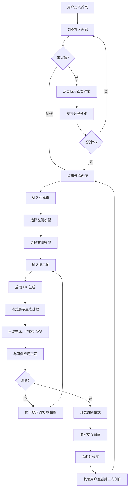

# Novita Arena - 产品概览

**版本**: 2.0
**最后更新**: 2025-01-18
**产品名称**: Novita Arena
**状态**: 设计阶段

---

## 目录

1. [产品概述](#1-产品概述)
2. [核心功能](#2-核心功能)
3. [用户体验与流程](#3-用户体验与流程)
4. [开发路线图](#4-开发路线图)
5. [成功指标](#5-成功指标)

---

## 1. 产品概述

### 1.1 产品定义

**Novita Arena** 是一个基于 Web App 视觉生成的 AI 对比与传播社区平台，让用户通过自然语言提示词生成交互式 Web 应用，同时对比不同 AI 模型的能力表现。

### 1.2 核心价值主张

- **降低开发门槛**: 让任何人都能无需编码即可创建交互式 Web 应用
- **模型对比**: 直观展示不同大语言模型的代码生成和审美能力
- **社区驱动**: 展示并分享 AI 生成的创作，构建开发者社区
- **流量入口**: 通过引人入胜的病毒式内容为 Novita API 平台引流

### 1.3 目标用户

- **主要用户**: 对 AI 代码生成能力感兴趣的开发者
- **次要用户**: AI/ML 爱好者和技术发烧友
- **第三用户**: 评估 AI 模型用于开发任务的技术决策者

---

## 2. 核心功能

### 2.1 创作模块

#### 基于 Prompt 的生成

- 用户输入自然语言描述想要的 Web 应用
- 系统调用 Novita LLM API 直接生成完整的 HTML 文件
- **约束**: 用户不能直接编辑生成的代码（零代码体验）

#### 单文件 HTML 生成（v2.0 简化架构）

**核心理念**: 用最简单的方案实现产品目标

- **单次 LLM 调用**: 直接生成完整的单文件 HTML
- **无需构建**: 不需要 npm install、Vite 构建等步骤
- **即时预览**: 生成完成后立即在 iframe 中预览
- **浏览器原生**: 利用浏览器自动修复 HTML 错误

**推荐的 CDN 库**（通过系统提示词推荐，按需使用）:

| 类别     | 库           | 用途             |
| -------- | ------------ | ---------------- |
| **样式** | Tailwind CSS | 快速样式开发     |
| **交互** | Alpine.js    | 轻量级响应式交互 |
| **图标** | Lucide Icons | 图标库           |
| **图表** | Chart.js     | 数据可视化       |
| **3D**   | Three.js     | 3D 渲染          |
| **动画** | Anime.js     | 动画效果         |
| **创意** | P5.js        | 创意编程         |

**素材资源**:

- **图片素材**: https://images.unsplash.com/ 或 https://picsum.photos/
- **头像素材**: https://i.pravatar.cc/

### 2.2 竞技模块

#### 双模型 PK 模式

- 同一提示词同时发送给两个不同的 AI 模型
- 左右分屏实时对比生成结果
- **并行生成**: 两个模型同时开始，独立流式展示
- 支持自由切换模型组合

#### 流式展示

- 生成过程中展示 Markdown 代码块风格的输出
- 终端风格（深色背景、等宽字体）
- 生成完成后自动切换到预览模式

#### 交互对比

- 用户可与两侧应用独立交互
- 每侧独立的全屏和刷新功能
- 对比 UI 差异、功能实现、代码质量

### 2.3 分享模块

#### 社区画廊

- 只有用户点击分享到画廊的才可见
- 允许用户点赞和复制提示词
- 分类: 热门、最新
  - 热门（初期）：官方精选 + 社区优秀案例
  - 热门（后期）：社区点赞量
  - 最新：用户分享的最新应用

#### 视频录制

- 基于 MediaRecorder API 的浏览器录制
- 上传到 Cloudflare Stream
- 可一键分享到 X, LinkedIn, Email

#### 一键复制

- 复制任何应用的提示词重新生成
- 支持在现有想法基础上迭代改进

### 2.4 账户模块

#### 统一认证

- 与 Novita 账户系统打通
- 单点登录体验

#### 额度与使用

- 匿名用户有免费使用次数限制（按 IP）
- 登录用户需要填写 Novita API Key
- 清晰展示使用情况

---

## 3. 用户体验与流程

### 3.1 主要用户旅程

### 3.1.1 用户旅程说明

**核心设计理念**：专注于 PK 对比体验，所有功能围绕"模型竞技"展开。降低用户门槛，提供智能输入引导。

**阶段 1: 发现灵感**

- 用户在首页浏览社区精选的 PK 案例
- 观看其他用户的创作（静态缩略图或视频）
- 点击"开始创作"进入生成页

**阶段 2: 快速配置对战**

- **智能输入引导**：
  - 选择灵感（如"时钟"、"游戏"、"数据可视化"）
  - 选择效果库（如"3D效果 > 粒子系统"）
  - 或直接输入自己的创意
- **默认模型配置**：
  - 左侧模型：默认 DeepSeek V3
  - 右侧模型：默认 Llama 3.1 70B
  - 用户可直接点击"开始 PK"使用默认配置
  - 也可自定义选择模型组合

**阶段 3: 实时对比**

- 左右分屏同时展示生成过程（Markdown 代码块风格）
- 生成完成后自动切换到预览模式
- 用户与两侧应用交互，对比效果
- 可以优化提示词重新 PK，或切换模型组合

**阶段 4: 录制与分享**

- 开启录制模式捕捉精彩交互
- 录制时只读提示词显示在顶部，作为附加信息
- 用户填写应用名称（可选使用 AI 生成）
- 分享到社交媒体或社区画廊
- 其他用户可以查看 PK 结果并二次创作

### 3.2 关键用户状态

#### 生成状态

- 预览区显示流式生成内容
- Markdown 代码块风格（终端风格）
- 生成错误时友好提示 + 重试按钮

#### 预览状态

- 生成完成后自动切换
- 使用 iframe srcdoc 直接渲染 HTML
- 如果 HTML 有错误，自动尝试修复

#### 空状态

- 未输入提示词时显示"灵感卡片"
- 示例: "构建一个 3D 时钟"、"创建粒子系统"、"制作扫雷游戏"
- 降低首次创作的门槛

---

## 4. 开发路线图

### 4.1 阶段规划（v2.0 简化版）

#### 阶段 1: MVP

**目标**: 核心功能可用

- 时间: 2 周
- 功能:
  - 双模型 PK 生成（流式）
  - HTML 预览（iframe srcdoc）
  - 基础画廊展示
  - 用户认证（Novita Auth）

#### 阶段 2: 录制分享

**目标**: 病毒式传播机制

- 时间: 2 周
- 功能:
  - 录屏功能
  - 视频上传（Cloudflare Stream）
  - 社交分享
  - 画廊点赞

#### 阶段 3: 体验优化

**目标**: 完善用户体验

- 时间: 2 周
- 功能:
  - 智能输入引导（灵感库）
  - 更多模型支持
  - 性能优化
  - 移动端适配

### 4.2 里程碑

| 里程碑               | 目标         | 成功标准                    |
| -------------------- | ------------ | --------------------------- |
| **M1: MVP 上线**     | 核心功能可用 | 成功生成 10+ 个可运行的应用 |
| **M2: 分享功能上线** | 具备传播能力 | 社交分享 > 20 次            |
| **M3: 公测上线**     | 公开发布     | 500+ 用户，社区案例 > 50 个 |

---

## 5. 成功指标

### 5.1 关键绩效指标 (KPIs)

#### 用户参与度

- **活跃用户**: 5,000+ 用户与 Model Arena 互动
- **画廊浏览量**: 社区画廊总页面浏览量
- **生成率**: 每用户平均生成应用数量

#### 内容与病毒传播

- **社交分享**: X (Twitter) 上 100+ 用户生成的案例
- **Fork 率**: 画廊应用被复制/二次创作的百分比
- **视频导出**: 录制并分享的视频数量

#### 转化

- **注册率**: 匿名用户创建账户的百分比
- **API Key 填写率**: 登录用户填写 API Key 的比例

#### 技术

- **生成成功率**: 成功生成可运行 HTML 的百分比（目标 > 90%）
- **平均生成时间**: 从提示词提交到预览完成的时间（目标 < 30s）
- **正常运行时间**: 活跃时段的平台可用性

### 5.2 测量工具

- **分析**: 页面浏览、用户流程、转化漏斗
- **数据库追踪**: 应用生成计数、模型使用分布
- **社交监控**: 话题标签提及、分享追踪
- **性能监控**: API 响应时间、错误率

---

## 相关文档

- **技术实现**: 详见 [01-技术规范.md](./01-技术规范.md)
- **页面设计**: 详见 [02-页面规范.md](./02-页面规范.md)
- **运营设计**: 详见 [03-运营与设计.md](./03-运营与设计.md)
