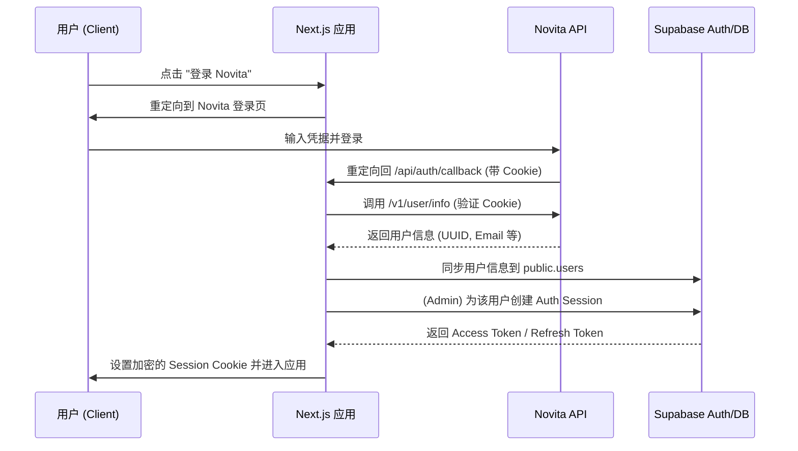

# Novita Auth 与 Supabase 在 Next.js 15 (App Router) 中的集成指南

本指南将详细介绍如何将 Novita 身份验证系统与 Supabase 集成，利用 Next.js 15 的 App Router 和 `@supabase/ssr` 实现生产级的用户管理和安全保护。

## 1. 架构概览

集成采用“身份桥接”模式：Novita 负责初次身份验证，Supabase 负责持久化用户数据、会话管理和行级安全性（RLS）。

### 身份验证流程



---

## 2. 数据库架构 (SQL)

在 Supabase SQL Editor 中执行以下脚本。我们将启用 `pgcrypto` 扩展来加密存储 Novita API Key，并设置 RLS 策略。

```sql
-- 启用加密扩展
CREATE EXTENSION IF NOT EXISTS pgcrypto;

-- 创建用户表
CREATE TABLE public.users (
  id UUID PRIMARY KEY DEFAULT gen_random_uuid(),
  novita_user_id VARCHAR(255) UNIQUE NOT NULL, -- Novita 的唯一标识
  novita_uuid VARCHAR(255) UNIQUE NOT NULL,    -- Novita 的内部 UUID
  email VARCHAR(255),
  username VARCHAR(100),
  first_name VARCHAR(100),
  last_name VARCHAR(100),
  tier VARCHAR(50) DEFAULT 'free',
  novita_api_key TEXT, -- 加密存储
  created_at TIMESTAMP WITH TIME ZONE DEFAULT NOW(),
  updated_at TIMESTAMP WITH TIME ZONE DEFAULT NOW()
);

-- 启用行级安全性 (RLS)
ALTER TABLE public.users ENABLE ROW LEVEL SECURITY;

-- 创建 RLS 策略：用户只能查看和更新自己的数据
CREATE POLICY "Users can view own profile" 
  ON public.users FOR SELECT 
  USING (auth.uid() = id);

CREATE POLICY "Users can update own profile" 
  ON public.users FOR UPDATE 
  USING (auth.uid() = id);

-- API Key 加密/解密助手函数 (使用环境变量中定义的秘钥)
-- 注意：在数据库层建议使用特殊的 vault 或专用加密列，此处为演示 pgcrypto
CREATE OR REPLACE FUNCTION encrypt_api_key(api_key TEXT, master_key TEXT)
RETURNS TEXT AS $$
BEGIN
  RETURN encode(pgp_sym_encrypt(api_key, master_key), 'base64');
END;
$$ LANGUAGE plpgsql SECURITY DEFINER;

CREATE OR REPLACE FUNCTION decrypt_api_key(encrypted_key TEXT, master_key TEXT)
RETURNS TEXT AS $$
BEGIN
  RETURN pgp_sym_decrypt(decode(encrypted_key, 'base64'), master_key);
END;
$$ LANGUAGE plpgsql SECURITY DEFINER;
```

---

## 3. 环境变量配置

在 `.env.local` 中配置以下变量：

```env
# Supabase 配置
NEXT_PUBLIC_SUPABASE_URL=https://your-project.supabase.co
NEXT_PUBLIC_SUPABASE_PUBLISHABLE_KEY=your-anon-key
NEXT_SUPABASE_SERVICE_ROLE_KEY=your-service-role-key # 用于同步用户，切勿暴露给前端
# 安全配置
NEXT_ENCRYPTION_MASTER_KEY=your-random-super-secret-key
```

### 3.1 客户端配置 (`lib/supabase/client.ts`)

```typescript
import { createBrowserClient } from '@supabase/ssr';

export function createClient() {
  return createBrowserClient(
    process.env.NEXT_PUBLIC_SUPABASE_URL!,
    process.env.NEXT_PUBLIC_SUPABASE_PUBLISHABLE_KEY!
  );
}
```

### 3.2 服务端配置 (`lib/supabase/server.ts`)

```typescript
import { createServerClient } from '@supabase/ssr';
import { cookies } from 'next/headers';

export async function createClient() {
  const cookieStore = await cookies();

  return createServerClient(
    process.env.NEXT_PUBLIC_SUPABASE_URL!,
    process.env.NEXT_PUBLIC_SUPABASE_PUBLISHABLE_KEY!,
    {
      cookies: {
        getAll() {
          return cookieStore.getAll();
        },
        setAll(cookiesToSet) {
          try {
            cookiesToSet.forEach(({ name, value, options }) =>
              cookieStore.set(name, value, options)
            );
          } catch {
            // 在 Server Component 中可能无法设置 Cookie，这是正常的
          }
        },
      },
    }
  );
}
```

## 3. 配置汇总

### 环境变量 (Environment Variables)

| 变量名 | 必填 | 说明 | 示例 |
|--------|------|------|------|
| `NEXT_PUBLIC_SUPABASE_URL` | 是 | Supabase 项目 URL | `https://xyz.supabase.co` |
| `NEXT_PUBLIC_SUPABASE_PUBLISHABLE_KEY` | 是 | Supabase Anon Key | `eyJhbGci...` |
| `NEXT_SUPABASE_SERVICE_ROLE_KEY` | 是 | Supabase 管理 Key (仅后端) | `eyJhbGci...` |
| `NEXT_ENCRYPTION_MASTER_KEY` | 是 | 用于加密 API Key 的主秘钥 | `32位随机字符串` |

### Cookie 设置

| Cookie 名称 | 用途 | 安全属性 |
|-----------|------|---------|
| `sb-xxx-auth-token` | Supabase 身份令牌 | HttpOnly, Secure, SameSite=Lax |
| `novita_session` | Novita 原始会话 (可选) | 由 Novita 设置 |

---

## 4. Novita 集成助手 (`lib/novita.ts`)

```typescript
import { cookies } from 'next/headers';

export interface NovitaUserInfo {
  user_id: string;
  uuid: string;
  email?: string;
  nickname?: string;
  // 根据实际 API 返回值调整
}

/**
 * 从 Novita API 获取当前登录用户信息
 */
export async function getNovitaUserInfo(): Promise<NovitaUserInfo | null> {
  const cookieStore = await cookies();
  const allCookies = cookieStore.getAll().map(c => `${c.name}=${c.value}`).join('; ');

  try {
    const response = await fetch(`https://api-server.novita.ai/v1/user/info`, {
      headers: {
        'Cookie': allCookies, // 透传 Novita 登录后的 Cookie
      },
    });

    if (!response.ok) return null;
    const data = await response.json();
    return data.data; // 假设返回格式为 { data: { ... } }
  } catch (error) {
    console.error('Failed to fetch Novita user info:', error);
    return null;
  }
}

/**
 * 校验 Novita API Key 是否有效
 */
export async function validateNovitaApiKey(apiKey: string): Promise<boolean> {
  try {
    const response = await fetch('https://api.novita.ai/v3/openai/chat/completions', {
      method: 'POST',
      headers: {
        'Authorization': `Bearer ${apiKey}`,
        'Content-Type': 'application/json',
      },
      body: JSON.stringify({
        model: 'deepseek/deepseek-v3',
        messages: [{ role: 'user', content: 'hi' }],
        max_tokens: 1,
      }),
    });
    return response.ok;
  } catch {
    return false;
  }
}
```

---

## 5. API 路由实现

### 5.1 Callback 处理器 (`app/api/auth/callback/route.ts`)

```typescript
import { NextRequest, NextResponse } from 'next/server';
import { createClient } from '@/lib/supabase/server';
import { getNovitaUserInfo } from '@/lib/novita';

export async function GET(request: NextRequest) {
  const novitaUser = await getNovitaUserInfo();
  
  if (!novitaUser) {
    return NextResponse.redirect(new URL('/login?error=auth_failed', request.url));
  }

  const supabase = await createClient(); // 使用 service role 的客户端用于管理用户
  const adminClient = await createAdminClient(); // 辅助函数，见下方说明

  // 1. 查找或创建用户
  const { data: existingUser } = await supabase
    .from('users')
    .select('id')
    .eq('novita_user_id', novitaUser.user_id)
    .single();

  let userId = existingUser?.id;

  if (!existingUser) {
    // 第一次登录，在 Supabase Auth 和 public.users 中同步创建
    const { data: authUser, error: authError } = await adminClient.auth.admin.createUser({
      email: novitaUser.email,
      email_confirm: true,
      user_metadata: { novita_user_id: novitaUser.user_id }
    });

    if (authError || !authUser.user) {
      console.error('Auth sync error:', authError);
      return NextResponse.redirect(new URL('/login?error=sync_failed', request.url));
    }

    const { data: newUser, error: dbError } = await supabase
      .from('users')
      .insert({
        id: authUser.user.id,
        novita_user_id: novitaUser.user_id,
        novita_uuid: novitaUser.uuid,
        email: novitaUser.email,
        username: novitaUser.nickname,
      })
      .select()
      .single();

    if (dbError) return NextResponse.redirect(new URL('/login?error=db_failed', request.url));
    userId = newUser.id;
  }

  // 2. 为该用户创建 Supabase Session
  const { data: sessionData, error: sessionError } = await adminClient.auth.admin.createSession({
    userId: userId!,
  });

  if (sessionError) return NextResponse.redirect(new URL('/login?error=session_failed', request.url));

  // 3. 设置 Cookie (通过 @supabase/ssr 的自动处理或手动设置)
  const response = NextResponse.redirect(new URL('/dashboard', request.url));
  
  // 关键：将 Supabase 会话写入 Cookie
  // 注意：此处实现取决于您的 createClient 配置，通常会自动通过 setAll 处理
  
  return response;
}

// 辅助：需要一个使用 SERVICE_ROLE_KEY 的客户端进行管理操作
async function createAdminClient() {
  const { createServerClient } = await import('@supabase/ssr');
  const { cookies } = await import('next/headers');
  const cookieStore = await cookies();

  return createServerClient(
    process.env.NEXT_PUBLIC_SUPABASE_URL!,
    process.env.NEXT_SUPABASE_SERVICE_ROLE_KEY!,
    { cookies: { getAll: () => cookieStore.getAll(), setAll: (c) => c.forEach(v => cookieStore.set(v.name, v.value, v.options)) } }
  );
}
```

### 5.2 获取当前用户信息 (`app/api/auth/me/route.ts`)

```typescript
import { NextResponse } from 'next/server';
import { createClient } from '@/lib/supabase/server';

export async function GET() {
  const supabase = await createClient();
  
  // 从 Supabase 获取当前登录用户
  const { data: { user }, error: authError } = await supabase.auth.getUser();
  
  if (authError || !user) {
    return NextResponse.json({ error: 'Unauthorized' }, { status: 401 });
  }

  // 从数据库获取完整资料
  const { data: profile, error: dbError } = await supabase
    .from('users')
    .select('id, email, username, first_name, last_name, tier, created_at')
    .eq('id', user.id)
    .single();

  if (dbError) {
    return NextResponse.json({ error: 'Profile not found' }, { status: 404 });
  }

  return NextResponse.json({ user: profile });
}
```

### 5.3 退出登录 (`app/api/auth/logout/route.ts`)

```typescript
import { NextResponse } from 'next/server';
import { createClient } from '@/lib/supabase/server';

export async function POST() {
  const supabase = await createClient();
  
  // 1. 清除 Supabase 会话
  await supabase.auth.signOut();
  
  // 2. 返回并让客户端清除相关的状态
  return NextResponse.json({ success: true });
}
```

### 5.4 保存 API Key (`app/api/auth/save-api-key/route.ts`)

```typescript
import { NextRequest, NextResponse } from 'next/server';
import { createClient } from '@/lib/supabase/server';
import { validateNovitaApiKey } from '@/lib/novita';

export async function POST(request: NextRequest) {
  const { apiKey } = await request.json();
  
  // 1. 后端校验 Key 有效性
  const isValid = await validateNovitaApiKey(apiKey);
  if (!isValid) {
    return NextResponse.json({ error: 'Invalid API Key' }, { status: 400 });
  }

  const supabase = await createClient();
  const { data: { user } } = await supabase.auth.getUser();
  
  if (!user) return NextResponse.json({ error: 'Unauthorized' }, { status: 401 });

  // 2. 使用数据库函数加密并存储
  const { error } = await supabase.rpc('update_user_api_key', {
    p_user_id: user.id,
    p_api_key: apiKey,
    p_master_key: process.env.NEXT_ENCRYPTION_MASTER_KEY
  });
  
  // 注意：需要先在 SQL 创建 update_user_api_key 函数，详见第8节安全实践

  if (error) return NextResponse.json({ error: error.message }, { status: 500 });
  return NextResponse.json({ success: true });
}
```

---

## 6. 中间件与路由保护 (`middleware.ts`)

```typescript
import { createServerClient } from '@supabase/ssr';
import { NextResponse, type NextRequest } from 'next/server';

export async function middleware(request: NextRequest) {
  let response = NextResponse.next({ request });

  const supabase = createServerClient(
    process.env.NEXT_PUBLIC_SUPABASE_URL!,
    process.env.NEXT_PUBLIC_SUPABASE_PUBLISHABLE_KEY!,
    {
      cookies: {
        getAll() { return request.cookies.getAll(); },
        setAll(cookiesToSet) {
          cookiesToSet.forEach(({ name, value, options }) => request.cookies.set(name, value));
          response = NextResponse.next({ request });
          cookiesToSet.forEach(({ name, value, options }) => response.cookies.set(name, value, options));
        },
      },
    }
  );

  // 刷新会话
  const { data: { user } } = await supabase.auth.getUser();

  // 保护路由：如果未登录且访问需要授权的页面
  const isProtectedRoute = request.nextUrl.pathname.startsWith('/dashboard') || 
                          request.nextUrl.pathname.startsWith('/api/user');
  
  if (isProtectedRoute && !user) {
    return NextResponse.redirect(new URL('/login', request.url));
  }

  return response;
}

export const config = {
  matcher: ['/((?!_next/static|_next/image|favicon.ico|.*\\.(?:svg|png|jpg|jpeg|gif|webp)$).*)'],
};
```

---

## 7. 前端组件

### 7.1 登录按钮组件

```tsx
'use client';

export function NovitaLoginButton() {
  const handleLogin = () => {
    const callbackUrl = `${window.location.origin}/api/auth/callback`;
    const loginUrl = `https://novita.ai/user/login?redirect_url=${encodeURIComponent(callbackUrl)}`;
    window.location.href = loginUrl;
  };

  return (
    <button 
      onClick={handleLogin}
      className="px-4 py-2 bg-blue-600 text-white rounded hover:bg-blue-700 transition"
    >
      使用 Novita 登录
    </button>
  );
}
```

### 7.2 Auth 状态管理 Hook (`hooks/use-auth.ts`)

```typescript
import { useEffect, useState } from 'react';
import { createClient } from '@/lib/supabase/client';
import { User } from '@supabase/supabase-js';

export function useAuth() {
  const [user, setUser] = useState<User | null>(null);
  const [loading, setLoading] = useState(true);
  const supabase = createClient();

  useEffect(() => {
    // 1. 获取初始用户
    const getUser = async () => {
      const { data: { user } } = await supabase.auth.getUser();
      setUser(user);
      setLoading(false);
    };

    getUser();

    // 2. 监听 Auth 状态变化
    const { data: { subscription } } = supabase.auth.onAuthStateChange(
      (_event, session) => {
        setUser(session?.user ?? null);
        setLoading(false);
      }
    );

    return () => subscription.unsubscribe();
  }, [supabase]);

  const logout = async () => {
    await fetch('/api/auth/logout', { method: 'POST' });
    await supabase.auth.signOut();
    window.location.href = '/login';
  };

  return { user, loading, logout };
}
```

### 7.3 受保护路由包装组件 (`components/auth/protected-route.tsx`)

```tsx
'use client';

import { useAuth } from '@/hooks/use-auth';
import { useRouter } from 'next/navigation';
import { useEffect } from 'react';

export function ProtectedRoute({ children }: { children: React.ReactNode }) {
  const { user, loading } = useAuth();
  const router = useRouter();

  useEffect(() => {
    if (!loading && !user) {
      router.push('/login');
    }
  }, [user, loading, router]);

  if (loading) {
    return (
      <div className="flex items-center justify-center min-h-screen">
        <div className="animate-spin rounded-full h-8 w-8 border-b-2 border-blue-600"></div>
      </div>
    );
  }

  if (!user) return null;

  return <>{children}</>;
}
```

---

## 8. 安全最佳实践

### 8.1 API Key 加密存储

不要直接存储明文 API Key。在 SQL 中使用 `update_user_api_key` 函数：

```sql
CREATE OR REPLACE FUNCTION update_user_api_key(
  p_user_id UUID, 
  p_api_key TEXT, 
  p_master_key TEXT
) RETURNS VOID AS $$
BEGIN
  UPDATE public.users 
  SET novita_api_key = encrypt_api_key(p_api_key, p_master_key),
      updated_at = NOW()
  WHERE id = p_user_id;
END;
$$ LANGUAGE plpgsql SECURITY DEFINER;
```

### 8.2 Cookie 安全性
在 `createServerClient` 的配置中，确保 Cookie 设置为 `httpOnly: true` 和 `secure: true`（生产环境）。

### 8.3 如何在后端使用解密后的 API Key

在调用 Novita LLM API 时，您需要解密存储在数据库中的 Key：

```typescript
/**
 * 获取用户解密后的 API Key
 */
export async function getDecryptedApiKey(supabase: any, userId: string) {
  const { data, error } = await supabase.rpc('get_user_api_key', {
    p_user_id: userId,
    p_master_key: process.env.NEXT_ENCRYPTION_MASTER_KEY
  });

  if (error || !data) return null;
  return data; // 返回明文 API Key
}
```

对应的 SQL 函数：

```sql
CREATE OR REPLACE FUNCTION get_user_api_key(
  p_user_id UUID, 
  p_master_key TEXT
) RETURNS TEXT AS $$
DECLARE
  encrypted_key TEXT;
BEGIN
  SELECT novita_api_key INTO encrypted_key 
  FROM public.users 
  WHERE id = p_user_id;
  
  IF encrypted_key IS NULL THEN
    RETURN NULL;
  END IF;

  RETURN decrypt_api_key(encrypted_key, p_master_key);
END;
$$ LANGUAGE plpgsql SECURITY DEFINER;
```

---

## 9. 测试指南

1. **登录测试**: 
   - 点击登录按钮，跳转 Novita。
   - 登录成功后返回应用，检查数据库 `public.users` 是否新增记录。
   - 检查浏览器 Cookie 是否包含 `sb-xxx-auth-token`。
2. **鉴权测试**:
   - 尝试直接访问 `/dashboard`，若未登录应重定向至 `/login`。
3. **API Key 测试**:
   - 在设置页面提交一个无效的 API Key，应提示错误。
   - 提交有效 Key，检查数据库中存储的是否为加密字符串（Base64 格式）。

---

## 10. 常见问题排查

- **Callback 无限循环**: 检查 Middleware 是否正确排除了静态资源和 API 回调路径。
- **User Sync 失败**: 确保 `NEXT_SUPABASE_SERVICE_ROLE_KEY` 具有操作 `auth.users` 的权限。
- **Novita User Info 返回 401**: 确认 Novita 域名的 Cookie 已被正确透传给 API 服务器。由于 Next.js 运行在您的域名下，而 Novita Cookie 可能属于 `novita.ai`，如果是非同源环境，请确保使用 Oauth2 流程或在同一主域下。
